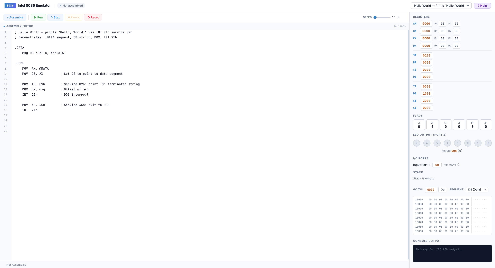
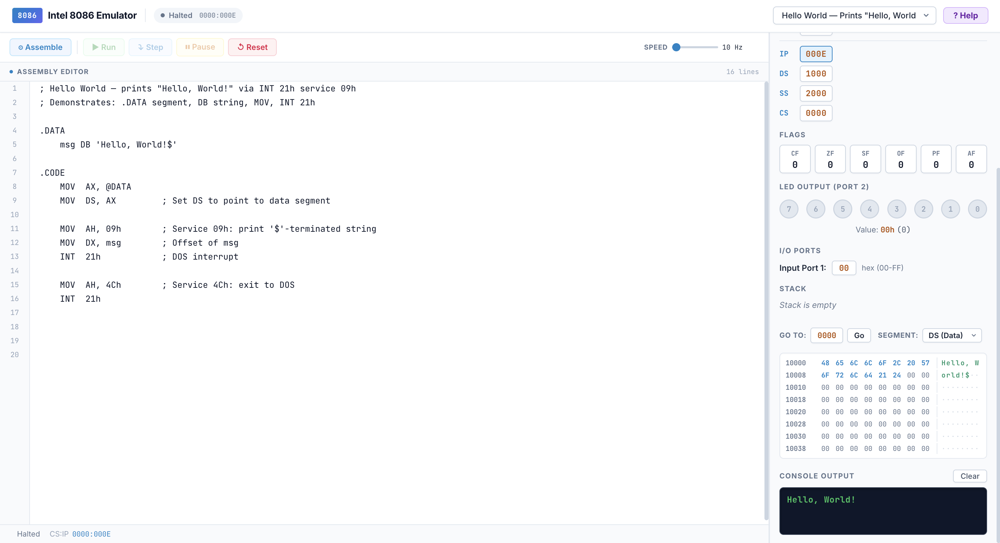
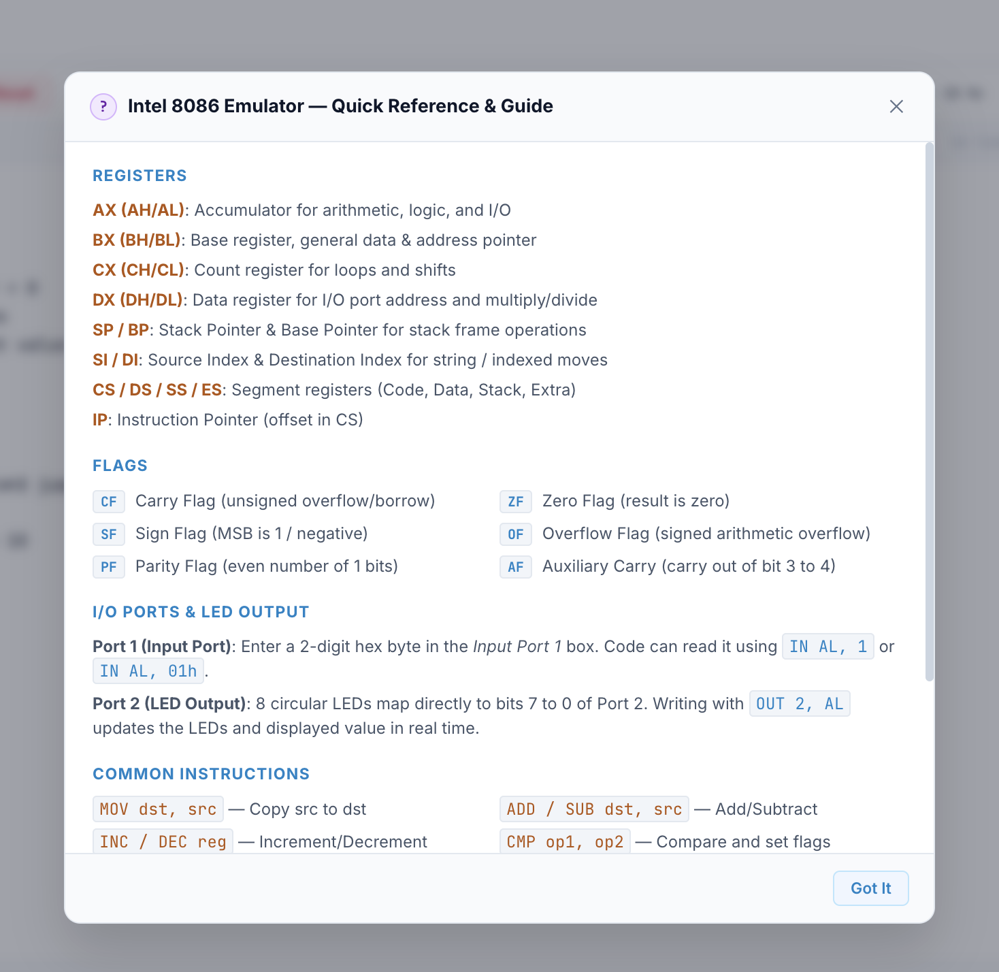
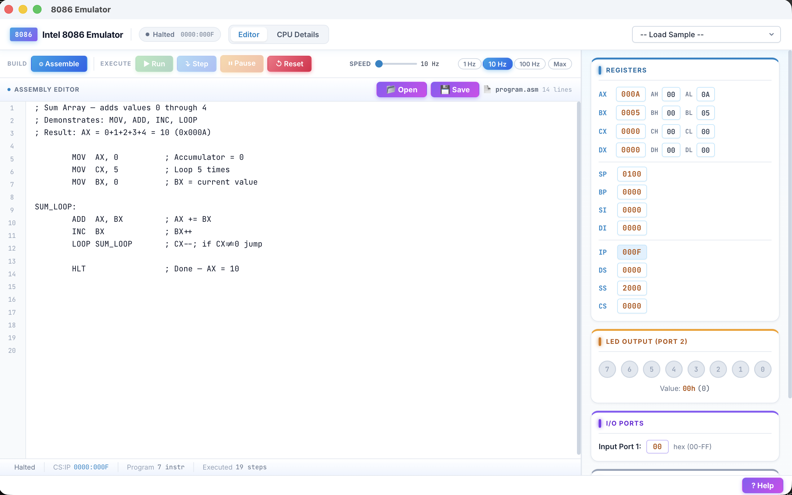
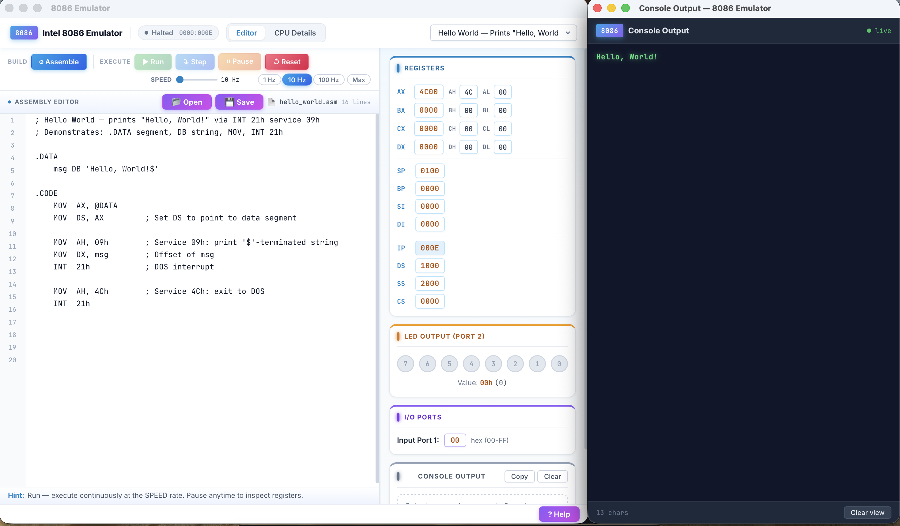
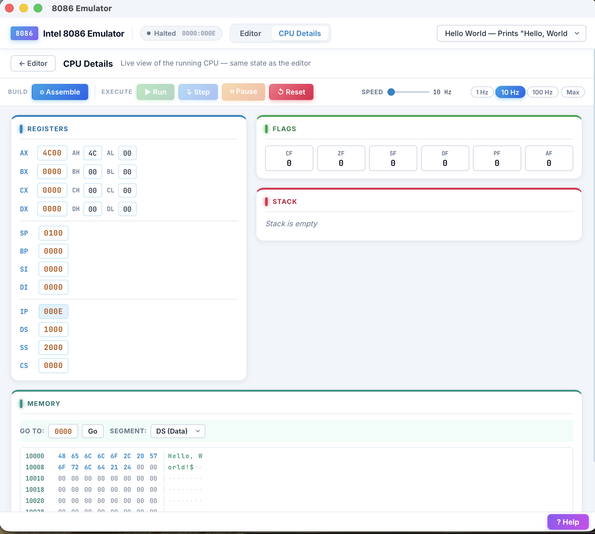

# 🖥️ 8086 Emulator

> **A browser-based Intel 8086 microprocessor emulator** — write x86 assembly, assemble it, and step through execution watching registers, flags, and memory update in real time. Also available as a **native macOS desktop app** (see below).

[](https://www.typescriptlang.org/)
[](https://react.dev/)
[](https://vitejs.dev/)
[](https://vitest.dev/)
[](../../releases)

---

## ✨ Features

- **In-browser assembler** — parse and assemble Intel 8086 mnemonics with no server required
- **Step-by-step execution** — run one instruction at a time or let the emulator run automatically at an adjustable speed
- **Live register panel** — monitor all 14 CPU registers (AX, BX, CX, DX, SP, BP, SI, DI, CS, DS, ES, SS, IP, FLAGS) updating in real time
- **Flags panel** — inspect individual CPU flags: CF, PF, AF, ZF, SF, TF, IF, DF, OF
- **Memory viewer** — browse the address space with hex/ASCII display
- **DOS INT 21h simulation** — emulated DOS interrupt services for character I/O and program exit
- **Output console** — see `INT 21h` character output printed live as the program runs
- **Built-in code samples** — load and run curated example programs instantly

---

## 🎬 Getting Started

### Prerequisites

- [Node.js](https://nodejs.org/) 18 or later
- npm (bundled with Node.js)

### Installation

```bash
# Clone the repository
git clone https://github.com/your-username/emulator_8086.git
cd emulator_8086

# Install dependencies
npm install
```

### Run in Development Mode

```bash
npm run dev
```

Open [http://localhost:5173](http://localhost:5173) in your browser.

### Run Tests

```bash
npm test
```
---

## 📸 Screenshots

### Emulator Interface


---

### Emulator Execution


---
### Emulator Features

---

## 💻 macOS Desktop App (no Node.js needed)

Prefer a native app over the browser? Grab the ready-made build from
[GitHub Releases](../../releases):

1. Download `Emulator8086_1.0.0_aarch64.dmg` (Apple Silicon Macs only).
2. Double-click it, drag **Emulator8086** into **Applications**, eject the image.
3. Launch **Emulator8086** from Applications or Spotlight.

### One-time Gatekeeper unblock

The app isn't Apple-signed, so macOS blocks the first launch. Either
right-click **Emulator8086** → **Open** → **Open**, or run once in Terminal:

```bash
xattr -cr /Applications/Emulator8086.app
```

The desktop build runs the same emulator core with native extras: program
output opens in a separate Console window automatically, a CPU Details page
(Registers / Flags / Stack / Memory) shares the live CPU, and Open/Save use
native Finder dialogs.

## 📸 Screenshots Of MacOS App

### Emulator App Interface


---

### Emulator Execution and features


---
### Emulator CPU Details Section

---


## 🗂️ Project Structure

```
Emulator_8086/
├── index.html                  # App entry point
├── src/
│   ├── main.tsx                # React root mount
│   ├── App.tsx                 # Root component — wires CPU, editor, panels
│   ├── index.css               # Global design system & component styles
│   ├── core/                   # Framework-agnostic emulator engine
│   │   ├── cpu.ts              # Intel 8086 CPU — instruction execution engine
│   │   ├── assembler.ts        # Assembler — source text → Instruction objects
│   │   ├── memory.ts           # Linear 1 MB memory model
│   │   ├── interrupts.ts       # INT 21h (DOS) interrupt handler
│   │   └── types.ts            # Shared TypeScript types & CPU state factory
│   ├── components/
│   │   ├── Editor.tsx          # Code editor with syntax highlighting
│   │   ├── Controls.tsx        # Run / Step / Reset / Speed controls
│   │   ├── RegisterPanel.tsx   # Live register display
│   │   ├── FlagsPanel.tsx      # CPU flags display
│   │   ├── MemoryViewer.tsx    # Hex memory viewer
│   │   └── OutputPanel.tsx     # Console output panel
│   └── samples/
│       ├── hello_world.asm     # INT 21h string output example
│       ├── fibonacci.asm       # Fibonacci using LOOP instruction
│       ├── countdown.asm       # Countdown from 10 with INT 21h output
│       ├── sum_array.asm       # Array summation example
│       └── index.ts            # Sample registry
├── tests/
│   └── core/
│       ├── cpu.test.ts         # CPU instruction-level unit tests
│       └── memory.test.ts      # Memory read/write unit tests
├── vite.config.ts
├── vitest.config.ts
├── tsconfig.json
└── package.json
```

---

## 🧠 Architecture

The emulator is split into two independent layers:

### Core Engine (`src/core/`)

Pure TypeScript with **no DOM or React dependency** — fully testable in Node.js.

| Module | Responsibility |
|---|---|
| `cpu.ts` | Fetches, decodes, and executes instructions; manages register and flag state |
| `assembler.ts` | Tokenizes source text, resolves labels, and emits `AssembledInstruction` objects |
| `memory.ts` | Provides a flat 1 MB `Uint8Array` with 8-bit and 16-bit (little-endian) accessors |
| `interrupts.ts` | Simulates INT 21h DOS services (char I/O, string output, program exit) |
| `types.ts` | TypeScript interfaces for `CPUState`, `Instruction`, `Operand`, and flag constants |

### UI Layer (`src/components/`)

React 18 components consume CPU state snapshots and display them reactively with zero direct CPU mutation from the UI.

---

## 📝 Supported Instructions

| Category | Instructions |
|---|---|
| **Data transfer** | `MOV`, `PUSH`, `POP`, `XCHG` |
| **Arithmetic** | `ADD`, `SUB`, `MUL`, `DIV`, `INC`, `DEC`, `NEG`, `CMP` |
| **Logic** | `AND`, `OR`, `XOR`, `NOT` |
| **Shift/Rotate** | `SHL`/`SAL`, `SHR`, `SAR`, `ROL`, `ROR` |
| **Control flow** | `JMP`, `JE`/`JZ`, `JNE`/`JNZ`, `JL`/`JNGE`, `JG`/`JNLE`, `JLE`, `JGE`, `JB`/`JNAE`, `JA`, `LOOP` |
| **Subroutines** | `CALL`, `RET` |
| **Interrupts** | `INT` (INT 21h simulated) |
| **Misc** | `NOP`, `HLT`, `CLC`, `STC`, `CLI`, `STI`, `CLD`, `STD` |
| **Directives** | `DB`, `DW` (data segment), labels (`:`) |

---

## 📦 Built-in Samples

Load any sample from the **Samples** dropdown in the UI:

| Sample | Description |
|---|---|
| `hello_world.asm` | Outputs a string via INT 21h service 09h |
| `fibonacci.asm` | Computes Fibonacci numbers using `LOOP` |
| `countdown.asm` | Counts 10 → 0, printing each digit via INT 21h |
| `sum_array.asm` | Sums elements of an array in memory |

---

## 🧪 Testing

Tests are written with [Vitest](https://vitest.dev/) and run entirely in Node.js — no browser required.

```bash
npm test
```

Test coverage includes:
- **`cpu.test.ts`** — instruction-by-instruction execution correctness, flag behaviour, register state
- **`memory.test.ts`** — 8-bit and 16-bit memory read/write, boundary conditions

---

## 🛠️ Scripts

| Command | Description |
|---|---|
| `npm run dev` | Start Vite development server with HMR |
| `npm test` | Run all unit tests with Vitest |
| `npm run build` | Type-check the project with `tsc --noEmit` |

---

## 📚 INT 21h Services Supported

| AH | Service |
|---|---|
| `01h` | Read character from stdin → AL |
| `02h` | Write character in DL to stdout |
| `06h` | Direct console I/O |
| `09h` | Write `$`-terminated string at DS:DX |
| `0Ah` | Buffered keyboard input |
| `4Ch` | Exit program (terminates emulation) |

---

## 🧰 Tech Stack

| Technology | Version | Purpose |
|---|---|---|
| [TypeScript](https://www.typescriptlang.org/) | 7.x | Type-safe core engine and UI |
| [React](https://react.dev/) | 18 | Reactive UI layer |
| [Vite](https://vitejs.dev/) | 5 | Development server & bundler |
| [Vitest](https://vitest.dev/) | 2.x | Unit testing framework |
| [Inter](https://fonts.google.com/specimen/Inter) + [JetBrains Mono](https://fonts.google.com/specimen/JetBrains+Mono) | — | UI typography |

---

## 📄 License

ISC License — see [LICENSE](LICENSE) for details.
